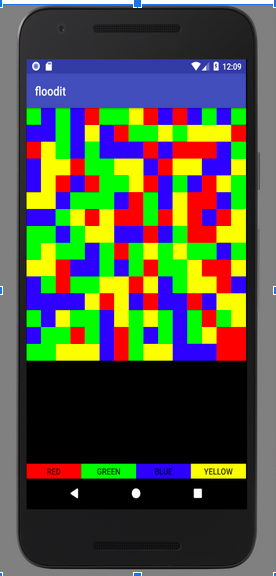
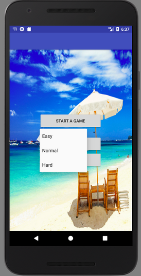
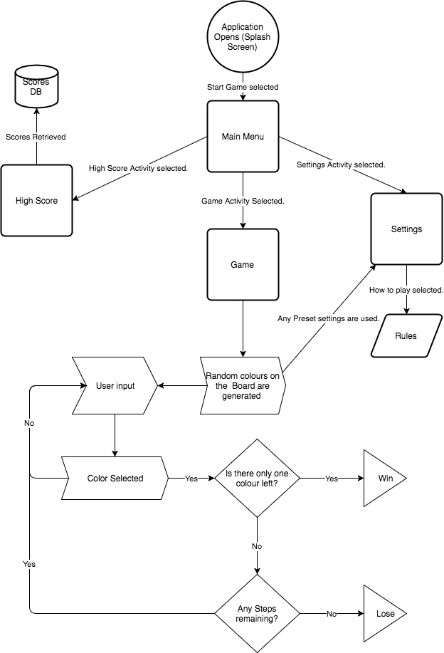
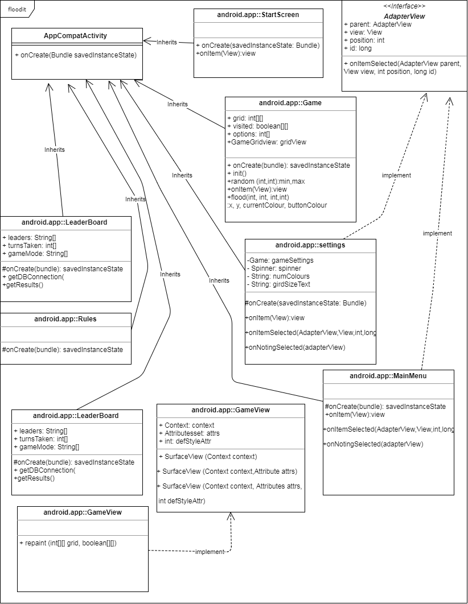

# Flood It

Flood it is a tile based game where the player must match all tiles on teh baord with the same colour. 
This application was created for my second year application programming unit using Andorid studo. 
This is a Andorid based game written in Java.

It makes uses of the of the "Flood Fill" algorithm to fill the select tiles on the board. 

## Game screen
 

## Main menus
  

## Flow Digram
  

## Floodit Logic
 

## Class Diagram Floodit
 

## View project
[See the Floodit project on github!](https://github.com/AlexMarriott/floodit)
